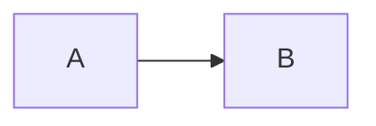

# Predictions for the 2022 world cup
Use aggregated player data from the statistics in the FIFA games from 2015 to 2022 to predict the score for the games in the 2022 world cup.

Features are aggregated (min, max, mean) player data (wages, skills, ...) per team (national or club) and the prediction is a class in the range 0 - 5 for goals scored by the home team.

The models trained on the data are classificaiton models using LightGBM and PyTorch.

